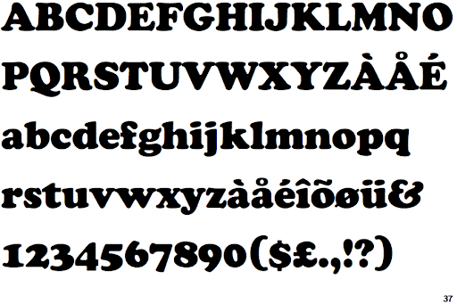

The public is often used to associating one typeface with a certain brand – take for example the famous Didot font used for the cover of Vogue magazine, or Netflix’s easily recognizable Bebas Neue, the majority of people would recognize the brand by the style of lettering they use. However, the same can go the other way around; meaning the typeface often hints at the tone and emotion of something it’s attached to. And musicians have quickly realized that, resulting in the continuous use of the Cooper Black font on the cover of music albums. 

Therefore, one question arises: what do Frank Ocean, Tyler, the Creator, Clara Ward and The Beach Boys - four artists with very different approaches on music - have in common? The answer you might be looking for is pretty surprising. They all have used Cooper Black on their album covers.   

The typeface created in 1920 by Oswald Cooper was able to revolutionize the typography used in advertisements and newspapers, being associated with nothing, in particular, thus creating endless possibilities to make use of it – unlike the sharp, serif fonts previously used. The font has no sharp edges touching the baseline, and utilizes negative space in an unconventional way – take for example the tilted negative space of the letter O. It works so well because the design of the letters allows for mixing uppercase and lowercase letters, and remains eligible even when printed in really small font size, with a condensed with of the lettering.

Over time, Cooper Black has become one of the most versatile yet bold typefaces ever created, gaining popularity especially after the invention of large-scale printers during the 1960s. When more room was given for graphic designers to make use of unique, new fonts, Cooper Black seemed to be the font most of them would always go back for. As a result, the typeface has been utilized on the covers of music albums for almost a century now, and surprisingly, they all vary in genre.

")

The Beach Boys’ pop album is a great example of how easy it is to puzzle up words when using this font. The S in Sounds fits perfectly between the B and O in Boys, while the E in Pet complements the D in Sounds – and all because of rounded edges that allow for unevenness. Generally, this font fits the trend of 70’s groovy, curvy typefaces, making an effective branding of the album during that time.

")

Frank Ocean’s debut studio album, channel ORANGE, showcases just how easy it is to pair Cooper Black with other typefaces. Dale Eisinger wrote for Complex in 2013 that “Employing the classic Cooper Black font—a staple of his Odd Future crew and hip-hop history, alike—next to a more modern, Sans-Serif font shows just how smart this dude is”.

")

Moving away from pop, but keeping on the same track of debuting albums, one might discover Tyler, the Creator’s Goblin. The pink-coloured font, paired with a thick black borderline is reminiscent of graffiti –which is often associated with hip-hop music-, making a great fit for this indie, temperamental album.

")

On the other side of the spectrum of music genres, The Clara Ward proves once again the versatility of Cooper Black, by using it on the cover of the jazz album Hang Your Tears Out to Dry. Here, similar to The Beach Boys, the font is more a matter of fitting the narrative of time rather than genre – the anticipation of the 70s trends in typography and design.

You can find out more on how this font is utilized in other fields, as well as more on the history of its creation by watching the video listed down below from Vox.

<iframe width="560" height="315" src="https://www.youtube.com/embed/Zu91meda2I8?rel=0" allow="accelerometer; autoplay; encrypted-media; gyroscope; picture-in-picture" allowfullscreen></iframe>

If you’re interested to see just how common this font really is, I suggest go visit your local record shop and have a look for yourself. You might be surprised just how flexible this typeface really is.