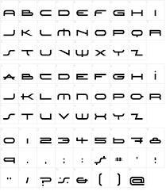
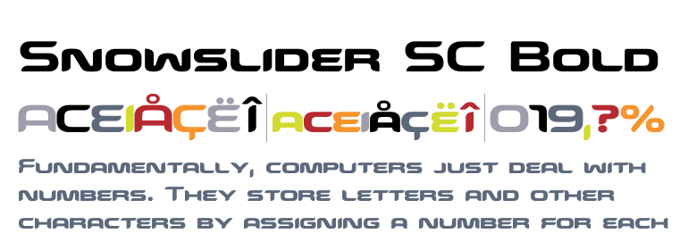
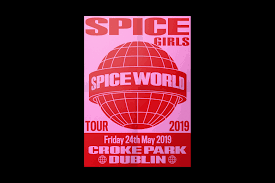

When thinking of the 90s, among the first things that come up are mullets, The Internet, and of course, the Boy Band and Girl Group craze (which would peak again during the 2010s). But, thankfully, the 90s were also when the music industry met digitalization – techno music was born, the synth was used in almost every one-hit-wonder song and album covers looked like posters of The Matrix you would see displayed at the cinema. Let’s take a trip down memory lane and look at some album covers that make use of digital typefaces and see how deep they immerse us in the cybernetic universe.

#### TLC - *FanMail (1999)*

")

A true digital masterpiece, the cover art for TLC’s album FanMail pays tribute to an era whose foundations had just been laid. Nathan Histed custom-designed the typeface used for the cover, and three years after the album launched, in 2002, he copyrighted the font. 

The heavyweight of the horizontally stretched letters, alongside the neon-like colour and 3D design, give a sense of cyborg dystopia, complementing the urban-soul sound of the album. The M in “MAIL” showcases an envelope, paying tribute to the fans, which sent TLC fan mail during their hiatus.

#### Backstreet Boys - *Millennium (1999)*

")

The year is 1999, and the American boy group Backstreet Boys tops the charts with Millennium, an album on which you might’ve heard I Want It That Way. The exact font has not been made public, although there are some similar versions free for download online, such as Snawslider SCBold, which both have heavyweight and condensed width. 

The sans serif font is dynamic and modern – the shapes of the letters form a far look not that different from each other, and some are even merged (the E and first N).  The typography and cover art surely give the Robocop vibe, especially because of –yet again- the neon-like white colour of the font.

#### Spice Girls - *Spice (1996)*

")

Yet another group – the famous Spice Girls – has hopped on the trend of creating an album cover with a futuristic vision. Although the initial font is not listed online, it is similar to Marianna Orsho’s rebranding of the Spice Grils’ logo from 2019. The creator says: “We wanted to capture the 90s design style but with a modern take”. California Grotesk is similar to the original typeface used.

