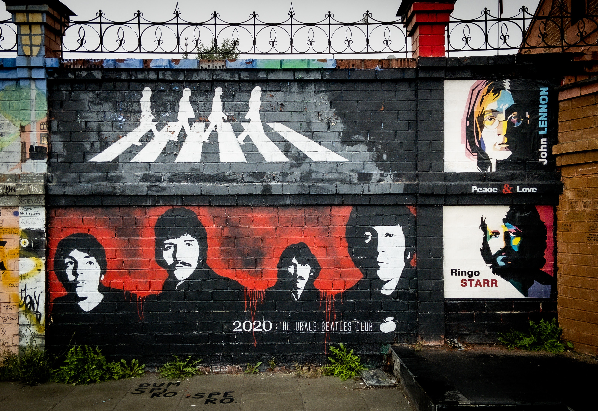
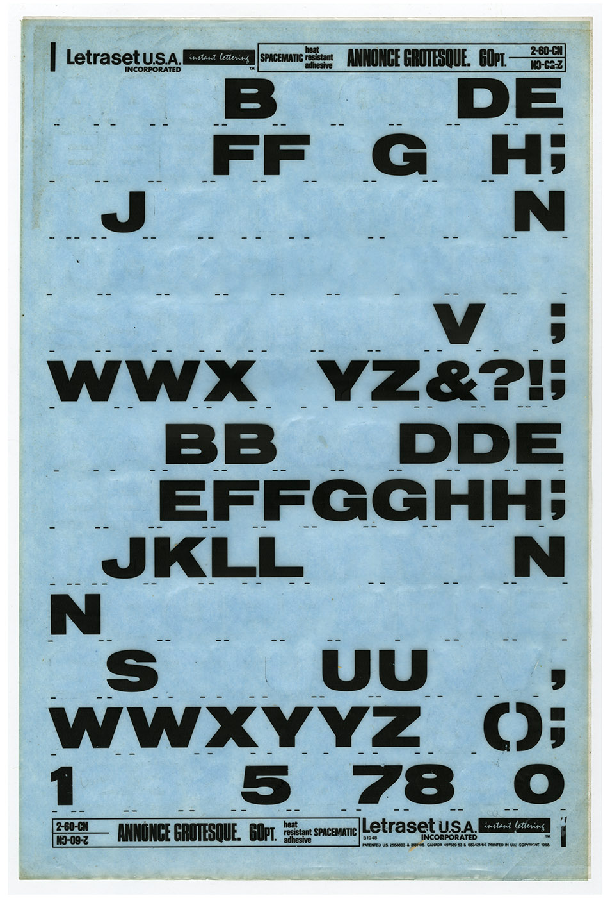
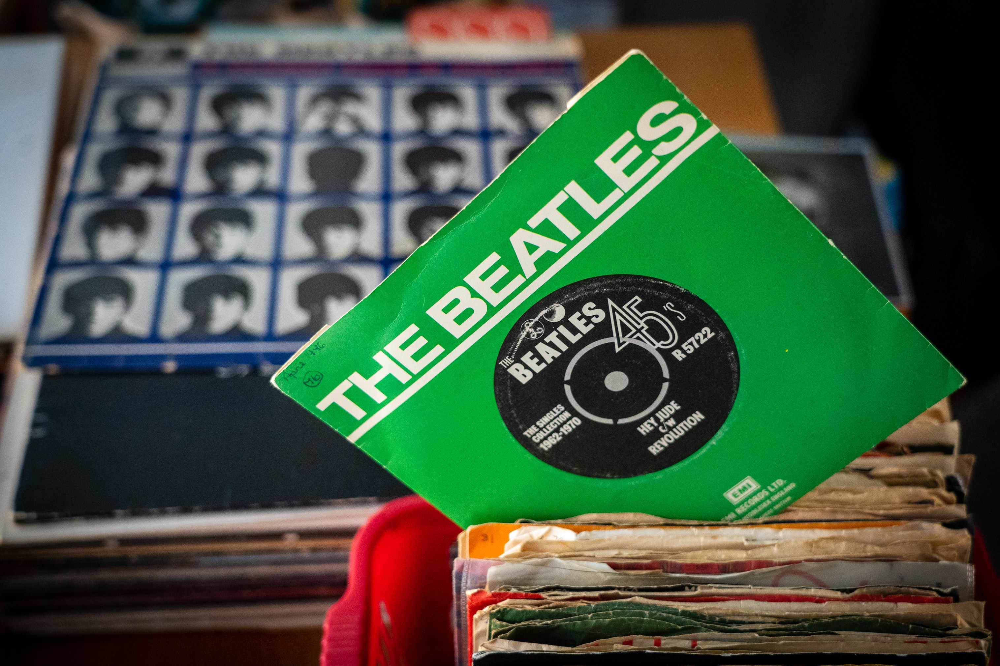
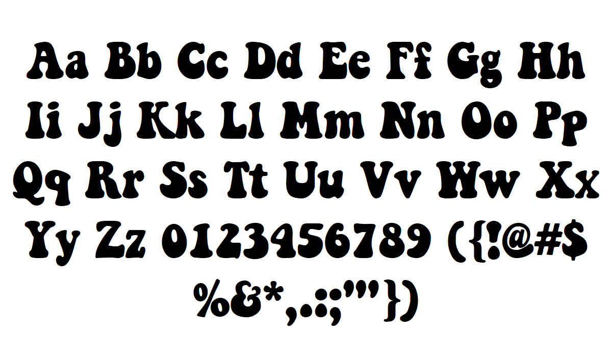
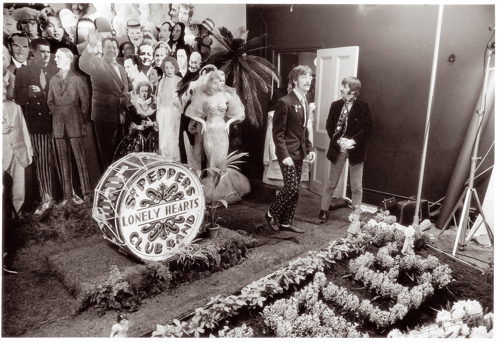

Liverpool based rock band, The Beatles are arguably one of the most influencial groups of all time, with an impressive discography and a legacy that's been handed down for generations. Apart from the amazing tunes they've produced over the years, the English band took the spotlight in the media and popular culture by creating amazing artworks to accompany their music, including cover albums, tour posters, campaigns and even movies. 

Here are our favourite Beatles album covers, explained. 

#### Please, please me (1963)

")

Initially, the debut studio album by the English rock band was supposed to feature the band’s members sitting outside the insect house at the London Zoo. However, after producer’s George Martin initiative was turned down, McBean relocated the shooting at EMI’s London Headquarters. 

The album cover features two different typefaces. The title and strapline utilise a very popular typeface at the time, *Annonce Grotesque*. The typeface used for the name of the band has not been made public, however, it can be recreated quite closely with *Compacta* font.

Although the typefaces and colour palettes used for the cover artwork are quite simple, later releases showcase the band’s drive towards more colourful, unique, fluid and abstract designs. 

#### Help! (1965)

")

The English photographer initially planned for this album cover to shoot the members spelling the letters *H-E-L-P* in flag semaphore - anticipating the phenomena sparked by Village People 1978 song *YMCA*. However, the final album cover spells *N-U-J-V*, as Freeman admitted he chose the arrangement of the arms that looked the best, regardless of the meaning. 

David Mikkelson wrote in 2019 about the possible meaning of the abreviation: 

> “In the world of Beatles conspiracy theory, *NUJV* is sometimes claimed to be an abbreviation for *“New Unknown James Vocalist,”* a reference to the look-alike and sound-alike musician who was supposedly tapped to secretly replace James Paul McCartney after the latter’s untimely death in the 1960s.”

A similar font to that used to write the name of the album could be *Granada* by Mikrojihad Typography. 

#### Rubber Soul (1965)

")

The story behind the album cover of their second 1965 release is rather interesting. The stretched-out appearance of both the image and the typography is the result of a well-timed accident. When photographer Robert Freeman was presenting what could be a possible cover, projecting it onto an album-sized piece of card, the card fell backwards, thus elongating the photograph. 

Paul McCartney revealed that the band’s reaction to that was positive: 

> “That’s it, Rubber So-o-oul, hey hey! Can you do it like that?’ And he said, ‘Well, yeah. I can print it that way.’ And that was it."

After that, Freeman assigned Art Director Charles Front to create the artwork for *Rubber Soul*. Front designed the lettering by “squeezing the words *Rubber Soul* into a shape that resembled the drip of rubber from a milked- rubber-tree (an early example of playful bubble-shaped lettering)”.

A similar font to that used on the cover is *Keep on Truckin' FW* by Brain Eaters Font Co.

#### Sgt. Pepper’s Lonely Hearts Club Band (1967)

")

At first glance, the cover resembles a tableau of famous faces, flowers and musical instruments. Designers Peter Blake and Jann Haworth put together a collage of 57 photographs and 9 waxworks (four of which are actually the band members dressed-up in suits, reminiscent of their Beatlemania era), which, in McCartney’s words, could be stared at for years. Some famous figures you might spot are Bob Dylan, Marilyn Monroe, Oscar Wilde, Sigmund Freud and Karl Marx.

> “We wanted the whole of Pepper to be so that you could look at the front cover for years and study all those people and read all the words on the back” - Paul McCartney

The psychedelia sound was successfully accompanied by a Flower-Power-like cover, bringing to life the fictional *Sgt. Pepper* band. The front cover, art-directed by Robert Fraser and photographed by Michael Cooper, depicts the band members seated behind a bass drum, on which fairground artist Joe Ephgrave painted the album's title. In the front of the setting, a flower arrangement spelling out “BEATLES” brings the whole composition together. 

It comes as no surprise that such a complex cover art would come to be fairly expensive. The total cost of the artwork reached nearly £3,000 (equivalent to £55,000 in 2019).