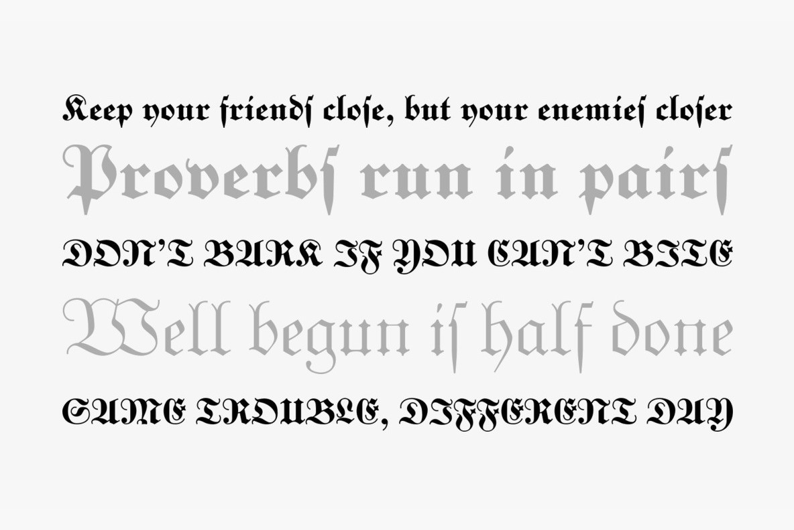
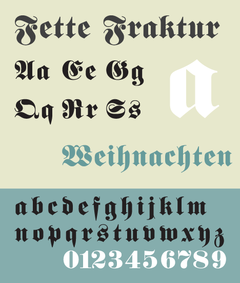
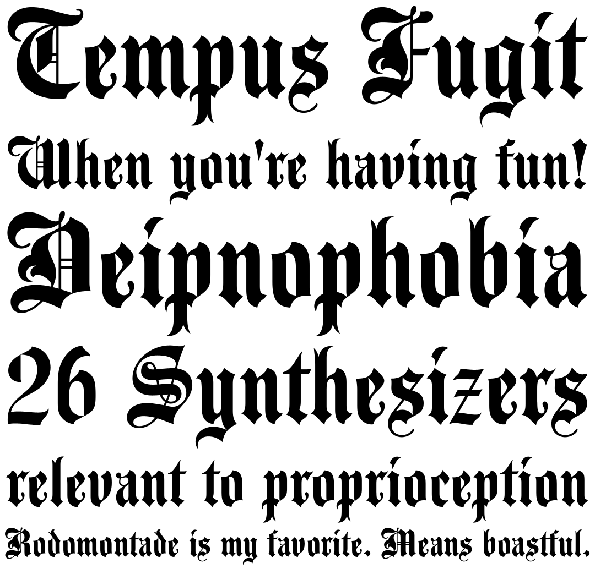

Seemingly, the new millennium had a delayed effect upon the design of big-name musicians’ album covers from the early 2000s. Artists like Beyonce, Sean Paul, Gwen Stefani and Akon utilised some form of medieval-inspired blackletter fonts on their covers, taking us all on a walk down memory lane. 

#### What about blackletter?

Cameron Chapman, the author of web design books *Color for Web Design* and *The Smashing Idea Book,* explains that blackletter - the oldest category of typefaces, dating back to the 1400s - is the predecessor of the first serif typefaces. The shift from handwritten calligraphy to print letters resulted in the creation of Serifs, which include “slight projections that finish off the strokes of their letterforms” (Chapman). 

#### How celebrities make use of gothic-like typefaces

Among this list of early 2000s albums, Beyonce and Snoop Dog appear more than once, as there seemed to have been a recurring theme for the musicians to make use of gothic-like typefaces to title their album covers. 

##### Beyonce

")

American singer Beyonce used it twice: on her second studio album *B’Day* (2006) and her first EP,  *Irreemplazable* (2007). In both cases, her name appears written in a blackletter font, which although has not been made public, could be reproduced by using *Unger Fraktur Fett* by RMU. In both cases, the name of the album has been written using *Copperplate* by URW Type Foundry typeface. 

##### Snoop Dog

Similarly, American rapper Snoop Dog used a typeface similar to *Ruca Regular* by URW Type Foundry over three times on his covers up until 2010, on records like *R&G (Rhythm & Gangsta): The Masterpiece (2004), Tha Blue Carpet Treatment (2006)* and *Ego Trippin’ (2008).* This typeface links the artist’s gangsta rap flow with the aesthetic of graffiti/street art (and consequently, street style) setting, where you would usually bump into variations of the font. 

: The Masterpiece (2004)")

")

> “The whole thing with graffiti letters is that they should be unique every time you paint, but should have a recognizable style every time. A font set only gives you one way of doing each letter, within a certain style” (Giant in Lynam, 2008: 139)

#### The Pussycat Dolls *\- PCD* (2005)

")

This is a perfect example of combining two seemingly unrelated typefaces and still making it work. *Nordique Pro Cyrillic* Light byLeksen Design (used for the group name) and *Fette Fraktur* by Johann Christian Bauer (used for the title) come together to create the perfect balance between new and old. 

#### Sean Paul - *The Trinity* (2005)  

")

For his third studio album, dancehall artist Sean Paul decided to match the vibe of the record by making use of the *Agincourt Std* by ITC typeface. The simple, double toned colour palette makes for an effective design of the cover.

