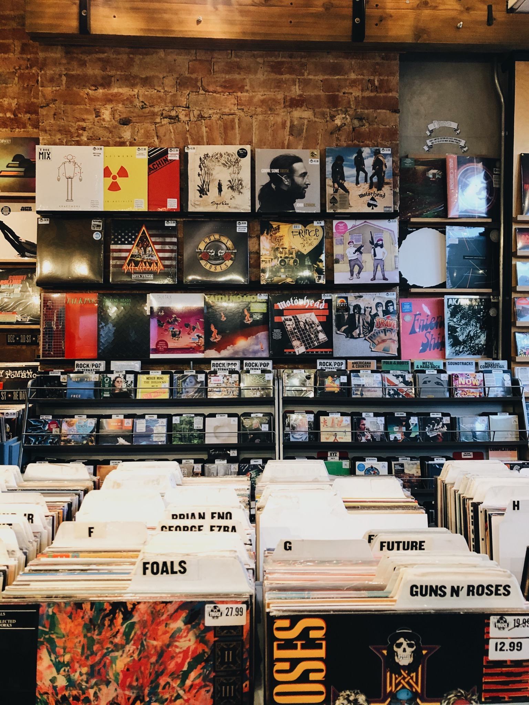
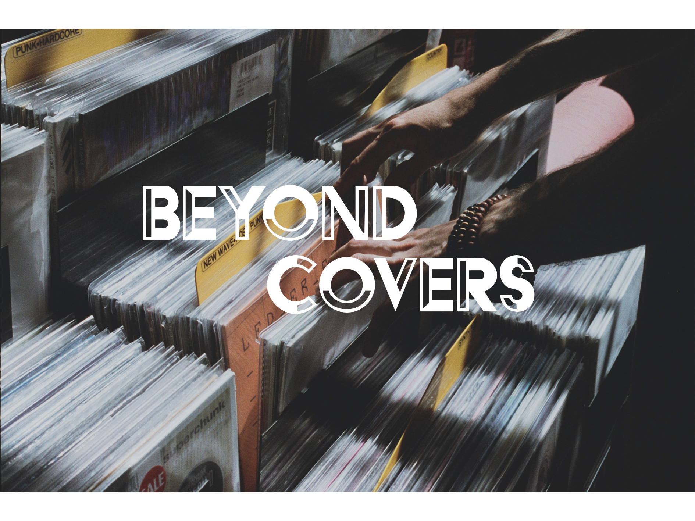
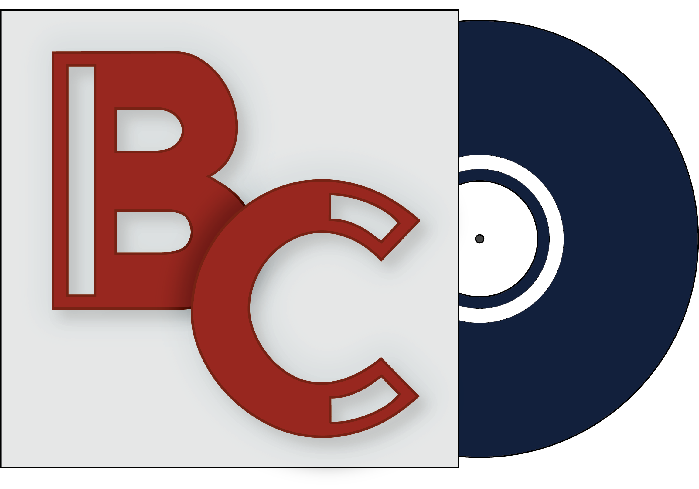

Picture this: you enter a record store on a late afternoon to look for new music and can't help but be mesmerized by the dazzling art that's everywhere - on vinyl casings, CD covers, on the walls. When you take a closer look, you notice how different and diverse each piece is, much like in a museum. And you can't help but wonder if there are any critics for this type of art as well. 

That circumstance is what inspired me to create this website. 

#### What is this website about? - A general overview

This website is all about typefaces as seen on album covers. An album title can tell you a lot about the artist's intentions and creative concept overall, and oftentimes this aspect of design gets overlooked by potential buyers and even critics. 

#### What am I aiming to achieve with this website? 

I am aiming to paint a simpler picture upon the link between typefaces and genre, as well as typography and artists' charisma overall, as they pair to create the art you see on cover albums. 

#### What should you expect to find on this website? 

You will find on this website an analysis on how typography has been used to develop effective covers throughout a wide range of genres (pop, hip-hop, rap, rock, reggae, gospel to name a few) as well as eras of music. Critical comparrisons have been made based on how good or bad a typeface has been in a certain time and genre. 

#### All about logo and banner image

I decided to keep the vintage, old-school vibe you would usually find in a record store and combine that with a modern, contemporary style you would expect to find on a website. The colour palette I chose resembles the vintage aesthetic of the 70s, with muted, earthy, contrasting tones. *The logo* is reminiscent of a vinyl that's coming out of a casing, on which I have placed the innitials of the website name. For that, I used the HFF Black Steel typeface in Regular. Similarly, *the banner* showcases a hand shuffling through a bunch of vinyl records. I used white for the the name of the website to contrast the dreamy, low brightness background. I chose a sans seriff font with the intention of making the website come accross as approachable, modern and clean; the decorative aspect the seriff brings is replaced by the creative logo and detailed images. 

#### The name of the website

The name of the website is pretty self-explanatory and hints at what you would find by reading the articles - Beyond Covers, as in unravelling the designer's intentions.